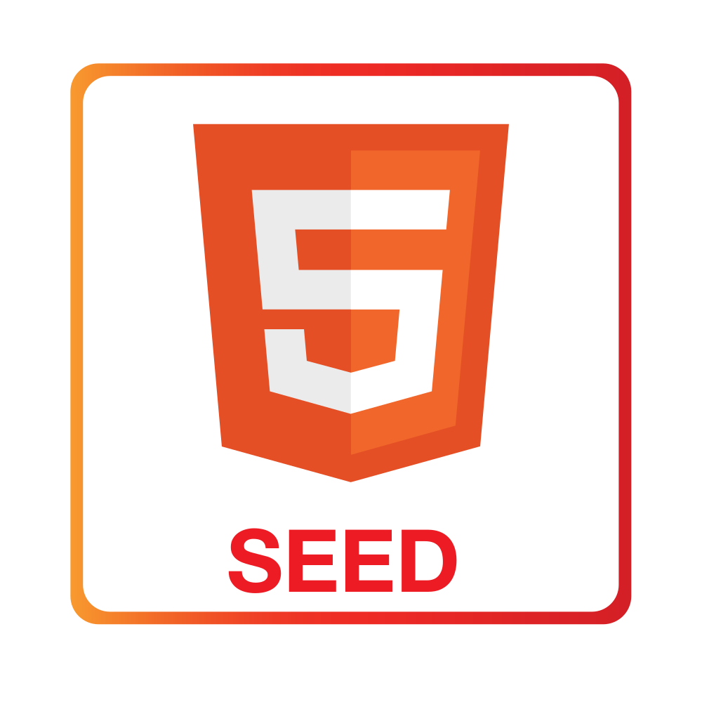

<p align="center">
    
    <br/>
    <h1 align="center">HTML Seed</h1>
    <p align="center" style="font-size: 1.2rem;">A starter kit for HTML5 static website development with a congenial build process.</p>
</p>

<!-- Badges -->
<p align="center">
  <a href="https://travis-ci.org/brionmario/html-seed">
    
  </a>
  <a href="#contributors">
    
  </a>
  <a href="https://david-dm.org/brionmario/html-seed">
    
  </a>
  <a href="https://david-dm.org/brionmario/html-seed?type=dev">
    
   </a>
  <a href="LICENSE.md">
    
  </a>
  <a href="https://codecov.io/gh/brionmario/html-seed">
  
</a>
</p>

This repository could be used by anyone who's looking for a quick starter kit for static website development. This boilerplate uses [Gulp](https://gulpjs.com/) for building and automating the workflow. Following are some key features we've included for you.

- The use of [Sass: Syntactically Awesome Style Sheets](https://sass-lang.com/) over CSS.
- Ready to go build system using Gulp.
- Simplified development process with npm scripts.
- Ability to use your favorite bower packages.
- Organized easy to use folder structure for beginners.

# Quick Links

| [Demo](https://html-seed.netlify.com) |
| ------------------------------------- |


# Quick start

> The generated project have dependencies that require `node` together with `npm`.

**Make sure you have [Node](https://nodejs.org/en/download/) version >= 8.0 and [npm](https://www.npmjs.com/) >= 5 or [Yarn](https://yarnpkg.com).**

```bash
# clone our repository
# --depth 1 removes all but one .git commit history
git clone --depth 1 https://github.com/brionmario/html-seed.git

# change the directory
cd html-seed

# install the dependencies
npm install

# start the development server
npm start

```

Once the dev server is fired up, it'll automatically open up a new tab. If not, navigate to [http://0.0.0.0:3000](http://0.0.0.0:3000) or [http://localhost:3000](http://localhost:3000) manually in your browser.

# Table of Contents

- [File Structure](#file-structure)
- [Getting Started](#getting-started)
  - [Prerequisites](#prerequisites)
  - [Setting Up](#setting-up)
  - [Running the app](#running-the-app)
- [Configuration](#configuration)
  - [Add third-party dependencies](#add-third-party-dependencies)
    - [Bower](#bower)
- [Styling](#styling)
- [Deployment](#deployment)
  - [Heroku](#deploy-to-heroku)
  - [Netlify](#netlify)
- [Built With](#built-with)
- [Contributing](#contributing)
- [Contributors](#contributors)
- [License](#license)

# File Structure

```
html-seed/
 ├── coverage/                      * unit test coverage reports
 ├── dev/                           * stores development build artifacts
 ├── dist                           * stores production build artifacts
 ├── docs/                          * contains documents and document resources
 ├── node_modules/                  * contains dependencies pulled from npm
 ├── src/                           * source folder
 │   ├── assets/                    * static assets such as images, icons, fonts goes here
 │   ├── bower_components/          * third party bower libraries will be copied here
 │   ├── sass/                      * styles folder
 │   │   ├── partials/              * place all the sass partial stylesheets in this folder
 │   │   └── styles.scss            * the main stylesheet for the project which gets compiled to CSS
 │   ├── scripts/                   * custom javascript script files
 │   └── index.html                 * entry HTML file.
 ├── .all-contributorsrc            * contains info ablout repo contributors
 ├── .babelrc                       * babel build config file
 ├── .bowerrc                       * bower config file
 ├── .buildpacks                    * contains heroku buildpacks
 ├── .dockerignore                  * contains files that are ignored from docker
 ├── .editorconfig                  * helps define and maintain consistent coding styles between different editors and IDEs
 ├── .eslintrc                      * ecmascript linting configuration file
 ├── .gitignore                     * contains files that are ignored from git
 ├── .netlify.toml                  * netlify config file
 ├── .npmrc                         * npm config file to house project wide custom configs
 ├── .nvmrc                         * node version manager config file
 ├── .pullapprove.yml               * pullapprove config file
 ├── .sass-lint.yml                 * sass linting configuration file
 ├── .travis.yml                    * travis ci configuration file
 ├── app.json                       * heroku manifest format for describing app
 ├── bower.json                     * contains bower dependencies
 ├── CONTRIBUTING.md                * project contributing guidelines
 ├── docker-compose.yml             * docker compose file
 ├── Dockerfile                     * docker config file
 ├── gulpfile.babel.js              * main buld configuration file. contains all the gulp tasks.
 ├── LICENSE.md                     * licensing information
 ├── package.json                   * contains all the npm scripts for building, running, deploying etc. and contains all the dependencies
 ├── Procfile                       * contains commands to be executed by heroku at app startup
 └── README.md                      * Readme file for the repository

```

# Getting Started

## Prerequisites

What you need to run this app:

- The generated project have dependencies that require `Node.js` together with `npm`.

> Make sure you have `Node.js` and `npm` installed by running the following simple commands on the command line and see if you're running the latest stable versions.

- Node.js - Type `node -v` on the terminal.
- npm - Type `npm -v` on the terminal.

If you do not have them installed, click [here](https://nodejs.org/en/download/) and grab the latest stable version of `node` and `npm` will be automatically installed along with it. Or if you have `brew` already installed in your local machine, execute `brew install node` command to get `node`.

The project requires `bower` to install project scope dependencies such as `bootstrap`, `jquery` etc. but it is not required to install bower on your local machines since `npm` installs `bower` as a project dependency. Also `bower install` command is run automatically by `npm` as a post install script.

In addition we've created `npm scripts` to run `gulp tasks` and `gulp` is installed by npm as a project depency. So you don't have to install `gulp` or `gulp cli` manually on your working machine.

## Setting Up

- `clone` the repository
- `cd html-seed` to change the directory
- `npm install` to install the dependencies with npm (installs bower dependencies as well using a post install script)

## Running the app

After you have installed all dependencies you can now run the app. Run `npm start` to start a local server using `gulp` which will watch your stylesheets and javascript files for changes, compile, minify, build and reload the browser automatically using `browser-sync` library.
The dev server will be opened in a new tab and usually on http://localhost:3000 and the Access URLs will be displayed on the terminal.

### server

```bash
# development
npm start

# production
npm run server:prod
```

# Configuration

The `gulp` tasks are defined inside the `gulpfile.babel.js` file found on the root of the application and you need to extend this file if you want to customize the application.

## Add third-party dependencies

### Bower

To use any third party bower libraries other than the included `jquery-mobile`, `jquery` and `font-awesome` libs, locate the package you want in the [bower package repository](https://bower.io/search/) and use the following command to add it to your project.

```bash
bower install $package --save
```

Take a look at the bellow example:

Lets say that you want to add `moment.js` to your project. Just run the command bellow.

```bash
bower install moment --save
```

NOTE: Some packages won't work as expected and you might have to do overrides in the `bower.json` file.

# Styling

The `styles.scss` file inside the `sass` directory is the main stylesheet for the project and will be compiled and minified into an external `.css` and is embedded in the `index.html` file.
If you want to add your own stylesheet, we recommend that you place it under the `scss/partials` folder and import it in the `styles.scss` file.

For example if you want to include the styles for a slider:

1. Create a `_slider.scss` partial file in the `scss/partials` directory.
2. In `styles.scss` add `@import 'partials/slider.scss';`

# Testing

Execute the following command to run your unit tests. We use [codecov](https://codecov.io/) package to generate test coverage reports and the generated reports can be found in the `coverage` folder.

```bash
npm run test
```

# Linting

Execute the following commands to generate linting for styles and scripts.

```bash
# all
npm run lint

# javascript
npm run lint:scripts

# sass
npm run lint:styles
```

# Deployment

## Building the app

### For Development

Execute the following command to build your files in the development mode. A new folder called `dev` will be created and the artifacts will be saved there.

```bash
npm run build:dev
```

### For Production

Execute the following command to build your files in the production mode. A new folder called `dist` will be created and the artifacts will be saved there.

```bash
npm run build
```

## Deploy to Heroku

Deploy to [Heroku](https://www.heroku.com/) using this template with one single click. Heroku has an awesome free plan and it is extremely easy to use.

Click [here](https://html-seed.herokuapp.com/) to see the deployed app.

<!-- Markdown snippet -->

[](https://heroku.com/deploy)


## Deploy to Netlify

Deploy to [Netlify](https://www.netlify.com/) using this template with one single click. It has an awesome free plan and a nifty [CLI](https://github.com/netlify/netlify-cli) which makes the deployment process much easier.

Click [here](https://html-seed.netlify.com/) to see the deployed app.

<!-- Markdown snippet -->

[](https://app.netlify.com/start/deploy?repository=https://github.com/brionmario/html-seed)

# Built With

<a href="https://www.npmjs.com/"></a>&nbsp;&nbsp;
<a href="https://bower.io/"></a>&nbsp;&nbsp;
<a href="https://sass-lang.com/"></a>&nbsp;&nbsp;
<a href="https://getbootstrap.com/docs/4.0/getting-started/introduction/"></a>&nbsp;&nbsp;
<a href="https://gulpjs.com/"></a>
<a href="https://jquery.com/"></a>&nbsp;&nbsp;

# Contributing

Please read [CONTRIBUTING.md](CONTRIBUTING.md) for contributing guidelines and to learn about our code of conduct.

# Contributors

Thanks goes to these wonderful people ([emoji key](https://github.com/kentcdodds/all-contributors#emoji-key)):

<!-- ALL-CONTRIBUTORS-LIST:START - Do not remove or modify this section -->
<!-- prettier-ignore -->
| [<br /><sub><b>Brion Mario</b></sub>](http://www.brionmario.com/)<br />[💻](https://github.com/brionmario/html-seed/commits?author=brionmario "Code") [📖](https://github.com/brionmario/html-seed/commits?author=brionmario "Documentation") [🐛](https://github.com/brionmario/html-seed/issues?q=author%3Abrionmario "Bug reports") [⚠️](https://github.com/brionmario/html-seed/commits?author=brionmario "Tests") |
| :---: |

<!-- ALL-CONTRIBUTORS-LIST:END -->

This project follows the [all-contributors](https://github.com/kentcdodds/all-contributors) specification. Contributions of any kind welcome!

# License

This project is licensed under the MIT License - see the [LICENSE.md](LICENSE.md) file for details.
